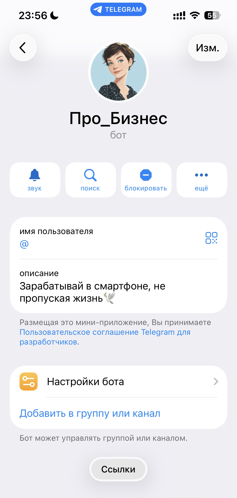
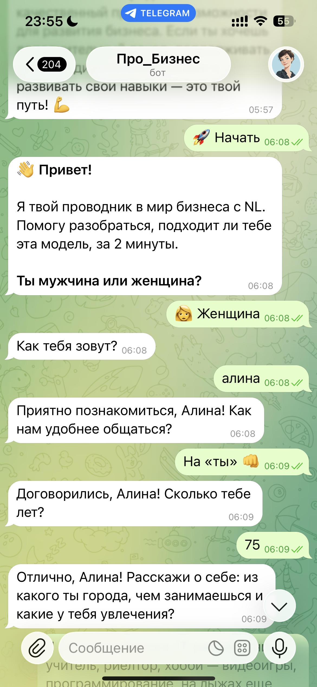
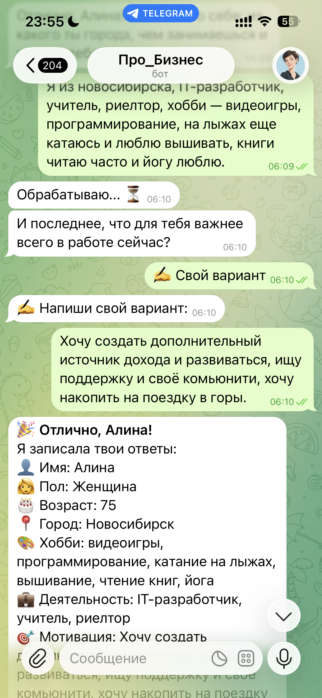
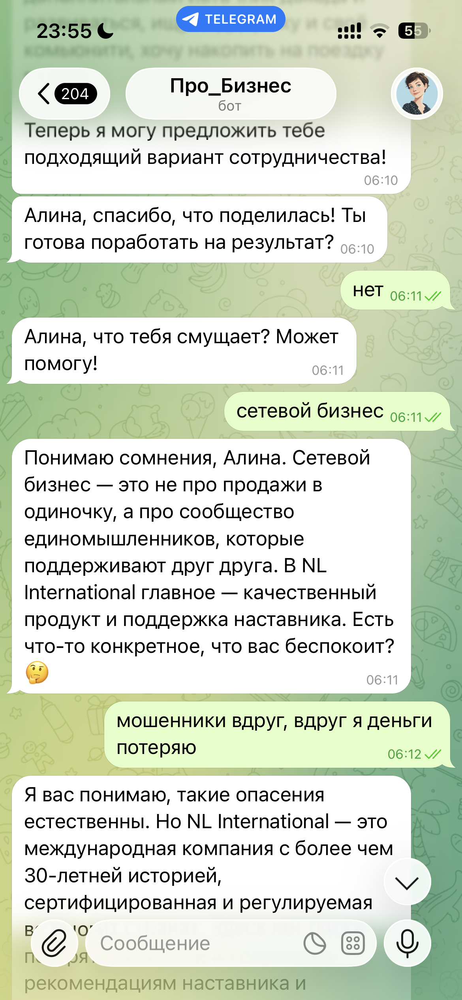
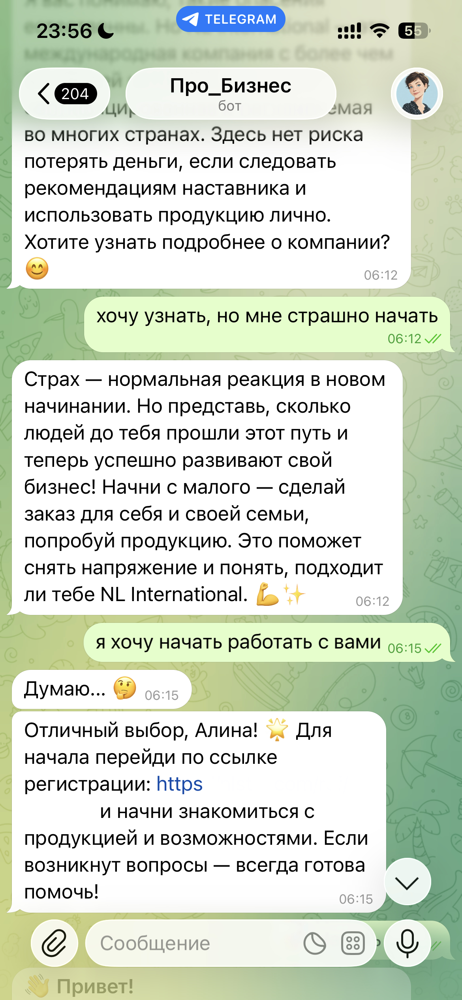
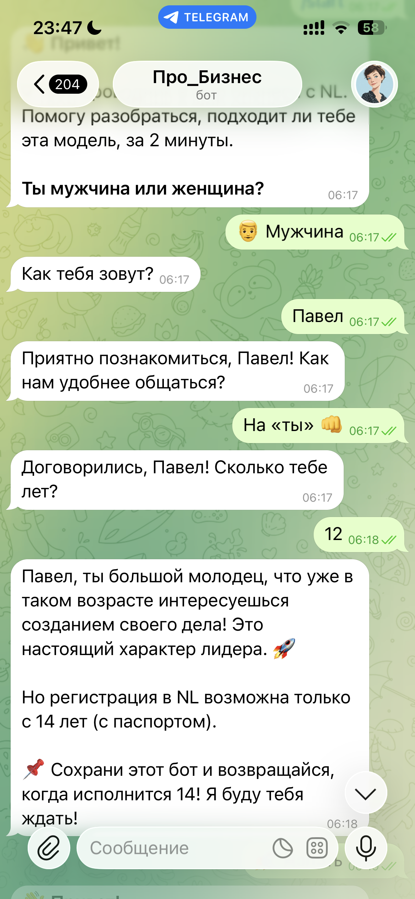

# 🤖 Бот Про_Бизнес

Интеллектуальный Telegram-бот для автоматизации первичного подбора и прогрева кандидатов в реферальный бизнес с использованием AI (GigaChat).

> 📚 **Учебный проект.** Создан для автоматизации личных задач и демонстрации навыков работы с Telegram Bot API, GigaChat и асинхронным Python.

## ✨ Особенности

- **Персонализированный подход**: Бот подстраивается под стиль общения пользователя («ты» или «Вы»)
- **AI-аналитика**: Использует GigaChat для анализа профиля пользователя из свободного текста
- **Умная воронка**: Проводит пользователя от знакомства до регистрации через этапы квалификации
- **Обработка возражений**: Интегрированный AI-консультант работает с типичными страхами («пирамида», «сетевой бизнес», «нет денег»)
- **История диалога**: Контекст общения сохраняется, AI помнит предыдущие сообщения
- **Автономная работа**: При отсутствии AI-доступа использует fallback-обработку
- **YouTube-ссылки**: В коде есть заглушки для видео (можно заменить на реальные ссылки)

## 🖼 Скриншоты








## 📋 Функционал

### Основное меню
| Кнопка | Описание |
|--------|----------|
| 🚀 Начать | Запуск квалификации кандидата |
| 💼 История наставника | Личная история успеха |
| 📝 Моя анкета | Просмотр заполненных данных |
| 🎯 Регистрация | Получение реферальной ссылки |
| 🙋‍♂️ Задать вопрос | Диалог с AI-консультантом |

### Этапы квалификации
1. Выбор пола
2. Ввод имени
3. Выбор стиля общения (на «ты» / на «Вы»)
4. Указание возраста
5. Заполнение анкеты (город, деятельность, хобби)
6. Определение мотивации (доход, развитие, свобода и др.)
7. Финальный блок с вариантами действий

## 🚀 Быстрый старт

### 1. Клонирование репозитория

### 2. Установка зависимостей

Создайте виртуальное окружение (рекомендуется):

```bash
python -m venv venv
venv\Scripts\activate  # Windows
# или
source venv/bin/activate  # Linux/Mac
```

Установите зависимости:

```bash
pip install -r requirements.txt
```

### 3. Настройка переменных окружения

Создайте файл `.env` в корне проекта (на основе `.env.example`):

```bash
cp .env.example .env
```

Отредактируйте `.env` и вставьте свои токены:

```
BOT_TOKEN=ваш_токен_бота
GIGACHAT_CLIENT_ID=ваш_client_id
GIGACHAT_CLIENT_SECRET=ваш_client_secret
REF_LINK=ваша_реферальная_ссылка
```

#### Получение токенов

**Telegram Bot Token:**
1. Напишите [@BotFather](https://t.me/BotFather) в Telegram
2. Отправьте `/newbot` и следуйте инструкциям
3. Скопируйте полученный токен

**GigaChat Credentials:**
1. Зарегистрируйтесь в [СберКлуд](https://sbercloud.ru/)
2. Создайте приложение в разделе GigaChat
3. Получите `CLIENT_ID` и `CLIENT_SECRET`

> ⚠️ **Важно:** Никогда не коммитьте `.env` с реальными токенами в публичный репозиторий!

### 4. Запуск

```bash
python main.py
```

Бот запустится и начнёт опрос новых пользователей.

## 📁 Структура проекта

```
NL_Kat1/
├── main.py              # Основной код бота (~350 строк)
├── config.py            # Конфигурация (токены)
├── .env                 # Локальные настройки (не публиковать!)
├── .env.example         # Пример конфигурации
├── requirements.txt     # Зависимости Python
└── README.md            # Документация
```

## 🛠 Стек технологий

| Технология | Версия | Описание |
|------------|--------|----------|
| Python | 3.11+ | Основной язык |
| aiogram | 3.x | Асинхронный фреймворк для Telegram |
| GigaChat | API | LLM от Сбера для NLP |
| aiohttp | latest | Асинхронные HTTP-запросы |
| pydantic | 2.x | Валидация данных |

## 🤖 Логика работы AI

Бот использует GigaChat для:

1. **Извлечения данных** — парсит свободный текст на город, профессию, хобби, мотивацию
2. **Ответов на вопросы** — персонализированные консультации в роли бизнес-наставника
3. **Обработки возражений** — спокойное разъяснение преимуществ при сомнениях
4. **Поддержания контекста** — история последних 10 сообщений сохраняется

### Пример промпта для извлечения данных:

```
Проанализируй текст пользователя и извлеки информацию.
Верни ТОЛЬКО JSON: {"city": "...", "profession": "...", "hobby": "...", "motivation": "..."}
```

## ⚙️ Конфигурация

### Переменные в `.env`

| Переменная | Описание | Обязательная |
|------------|----------|--------------|
| `BOT_TOKEN` | Токен Telegram бота | Да |
| `GIGACHAT_CLIENT_ID` | Client ID для GigaChat | Нет* |
| `GIGACHAT_CLIENT_SECRET` | Client Secret для GigaChat | Нет* |
| `REF_LINK`| Реферальная ссылка | Да |

\* Без GigaChat бот работает в режиме fallback-обработки (без AI)

## 🧪 Тестирование

Проверка установки зависимостей:

```bash
python -c "import aiogram; print(f'aiogram {aiogram.__version__}')"
```

## 🐛 Troubleshooting

| Проблема | Решение |
|----------|---------|
| `ModuleNotFoundError: No module named 'aiogram'` | `pip install -r requirements.txt` |
| `ReadTimeoutError` при запуске | Увеличьте таймауты или проверьте интернет-соединение |
| `Invalid token` | Проверьте `BOT_TOKEN` в `.env` |
| `REF_LINK not found` | Добавьте `REF_LINK` в `.env` |
| GigaChat не отвечает | Проверьте `CLIENT_ID` и `CLIENT_SECRET`, убедитесь в доступе к API |

## 📝 Команды бота

| Команда | Описание |
|---------|----------|
| `/start` | Запуск/перезапуск квалификации |
| `/cancel` | Отмена текущего режима диалога |

## 📄 Описание проекта

**Назначение:** Автоматизация первичной квалификации кандидатов в реферальный бизнес.

**Цель создания:** Учебный проект для отработки навыков работы с:
- Telegram Bot API (aiogram 3.x)
- Интеграцией с LLM (GigaChat)
- Асинхронным программированием на Python
- FSM (Finite State Machine) для управления диалогом

**Сфера применения:** Личная автоматизация задач в рамках реферального бизнеса.

**Автор:** Индивидуальная разработка

## 🚀 Планы по развитию (Roadmap)

Проект представляет собой MVP, и в будущем планируется расширение функционала:
- **Интеграция с Google Таблицами**: Автоматический экспорт данных квалифицированных кандидатов в таблицу для удобного ведения базы лидов наставником.
- **Уведомления для наставника**: Моментальное оповещение в Telegram наставнику, когда кандидат успешно проходит все этапы воронки и готов к личному общению.
- **Расширенная аналитика**: Внедрение системы отслеживания конверсии на каждом этапе (сколько людей отвалилось на вопросе о возрасте, сколько дошло до ссылки).
- **Интеграция с CRM**: Передача данных о «горячих» кандидатах в CRM-систему для полноценного управления воронкой продаж.

## 🔒 Конфиденциальность и ограничения

### Защита данных
- **Бот не хранит личные данные пользователей** — вся информация обрабатывается в рамках текущей сессии
- Данные анкеты сохраняются только в оперативной памяти (MemoryStorage) и удаляются при перезапуске бота
- **Не сохраняйте чувствительные данные** в диалоге с ботом

### Возрастное ограничение 14+
- Регистрация в реферальных компаниях обычно возможна **только с 14 лет** (требуется паспорт)
- Если пользователь указывает возраст **менее 14 лет**, бот:
  - Не выдаёт реферальную ссылку на регистрацию
  - Предлагает вернуться после достижения возраста
  - Ограничивает функционал только просмотром информации

## 📄 Лицензия

Проект создан в **образовательных целях**. Учётные данные GigaChat API являются конфиденциальными и не должны распространяться.

Для коммерческого использования требуется отдельная лицензия.

## 👥 Авторы

**Разработчик:** Индивидуальная разработка

Проект создан в рамках обучения и для автоматизации бизнес-задач.

## 📞 Поддержка

При возникновении проблем:
1. Проверьте наличие токенов в `.env`
2. Убедитесь в наличии интернет-соединения
3. Изучите логи в консоли
4. Проверьте актуальность токена бота в BotFather

---

**Бот Про_Бизнес** — ваш AI-ассистент для автоматизации работы с кандидатами 🚀
